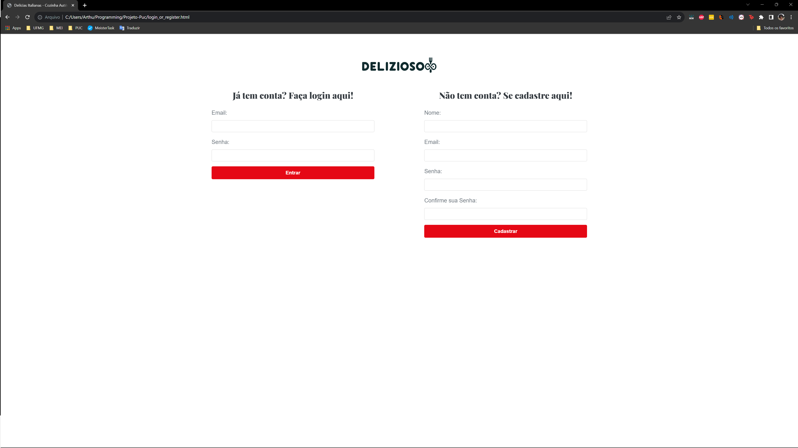
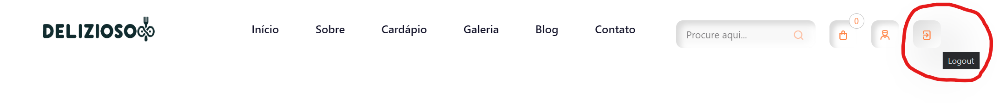
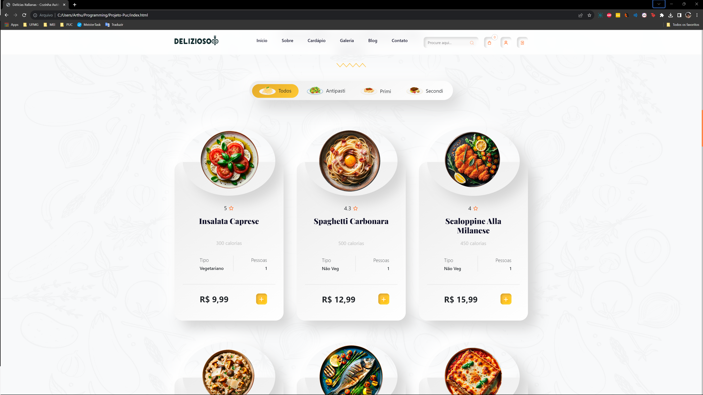
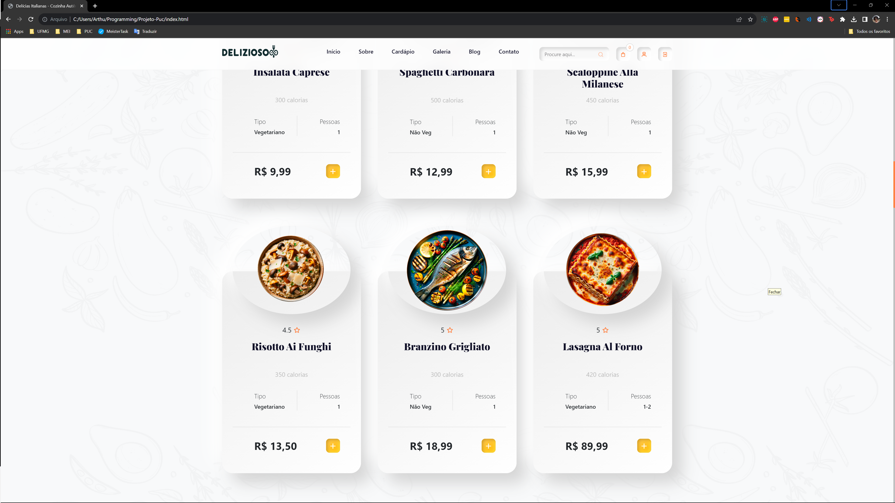
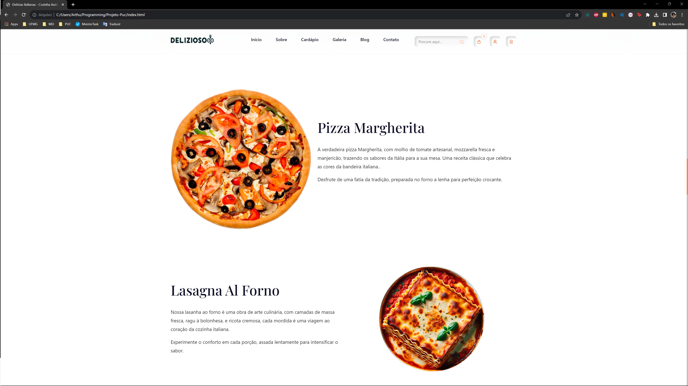
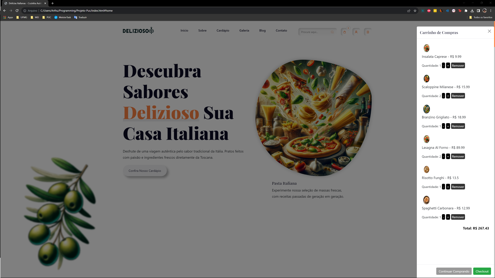
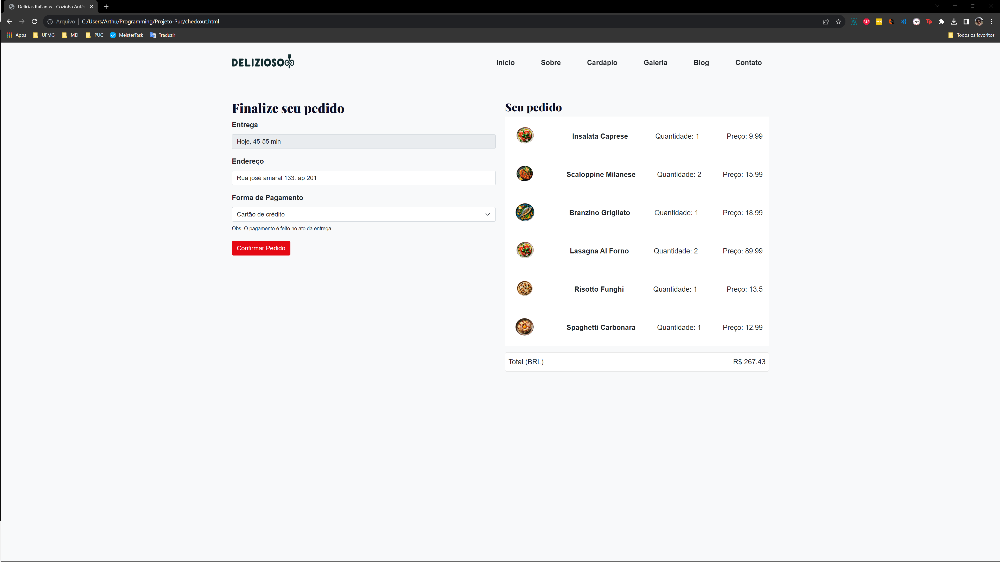
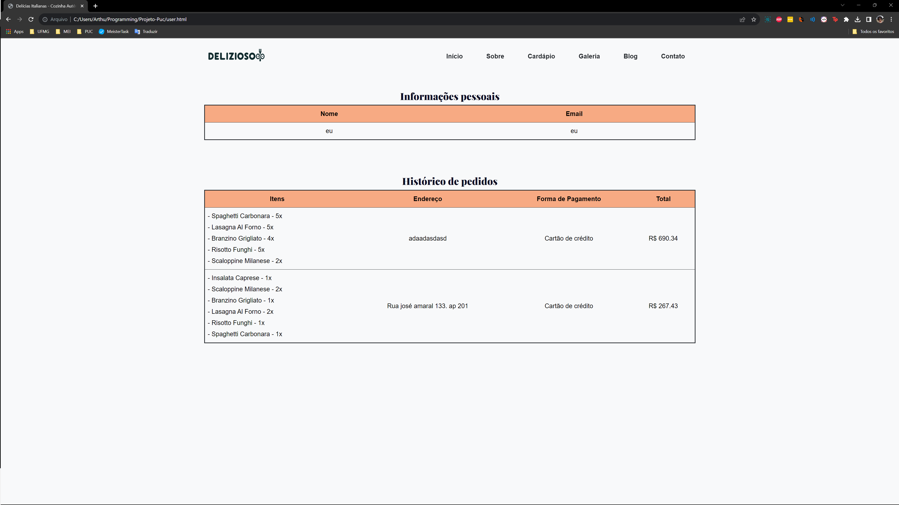

# Grupo SI_AppWeb_2o2023_Grp03

# Delizioso

Delivery e exposição/propaganda/publicidade de culinária italiana

# Problema & Justificativa
A necessidade de desenvolver um novo software surge da demanda tanto de entusiastas de comida italiana quanto de proprietários de restaurantes italianos. Este problema é caracterizado pela dificuldade de encontrar restaurantes que ofereçam pratos italianos autênticos a preços acessíveis, juntamente com as limitações encontradas nos atuais aplicativos de entrega de comida.

Para os entusiastas, a falta de opções de qualidade e a insatisfação com os serviços de entrega existentes são evidentes. A solução proposta busca proporcionar uma plataforma que permita aos clientes escolher pratos italianos de alta qualidade, garantindo a autenticidade e a acessibilidade dos pratos. Além disso, a plataforma visa oferecer a comodidade de entrega em casa, eliminando os problemas enfrentados com os serviços de entrega convencionais.

Para os proprietários, o problema reside na dificuldade de atrair clientes que compartilhem sua paixão pela comida italiana e na falta de controle sobre a qualidade do serviço de entrega. O software proposto visa conectar esses restaurantes a uma base de clientes interessados em comida italiana, possibilitando a oferta de pratos especiais e a coleta de feedback valioso. Além disso, a plataforma busca proporcionar uma alternativa de entrega que não esteja sujeita a taxas excessivas e que permita um maior controle sobre a qualidade do serviço de entrega.

Dessa forma, a criação desse novo software se justifica como uma solução abrangente para atender às necessidades dos entusiastas de comida italiana e dos proprietários de restaurantes italianos, proporcionando uma experiência aprimorada de escolha e entrega de pratos italianos autênticos, com preços acessíveis e qualidade garantida.

# Requisitos
## Funcionais
O cliente deve ser capaz de: 
- criar uma conta
- fazer login

- visualizar o menu de produtos

- adicionar um produto ao carrinho
- remover um produto do carrinho

- visualizar o carrinho
- fazer checkout no carrinho
  - escolher o endereço de entrega
  - escolher a forma de pagamento

- visualizar o histórico de pedidos
- visualizar informações de um pedido

## Não funcionais
- A interface do usuário deve ser intuitiva e de fácil navegação, garantindo uma experiência amigável para o cliente e o restaurante.
- O sistema deve ser compatível com os principais navegadores da web, como Chrome, Firefox, Safari e Edge.
- A aplicação deve ser acessível a pessoas com deficiência, seguindo diretrizes de acessibilidade, como o WCAG (Web Content Accessibility Guidelines).
- O mecanismo de pesquisa de produtos e restaurantes deve ser eficiente e fornecer resultados relevantes com rapidez.
- Utilizar um sistema de controle de versões para rastrear alterações no código e facilitar a colaboração entre desenvolvedores.
- Manter a segurança das sessões do usuário e a autenticação de forma consistente e confiável.

# Entregas
## Fase 1
Problema, justificativa e requisitos funcionais e não funcionais.

## Fase 2
Template padrão

## Fase 3
Funcionalidades estáticas

## Fase 4 
Programação de Funcionalidades - Javascript

# prints
- criar uma conta
- fazer login

- fazer logout

- visualizar o menu de produtos

- adicionar um produto ao carrinho
- remover um produto do carrinho
- visualizar o carrinho

- fazer checkout no carrinho
  - escolher o endereço de entrega
  - escolher a forma de pagamento

- visualizar o histórico de pedidos
- visualizar informações de um pedido
- 
